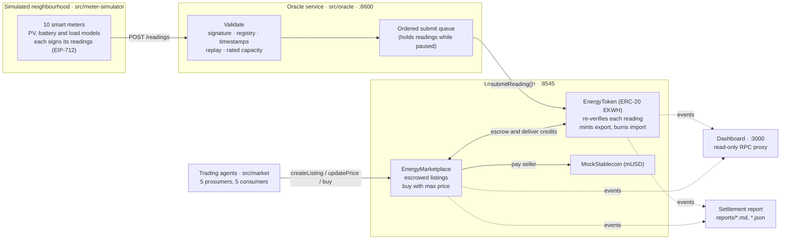
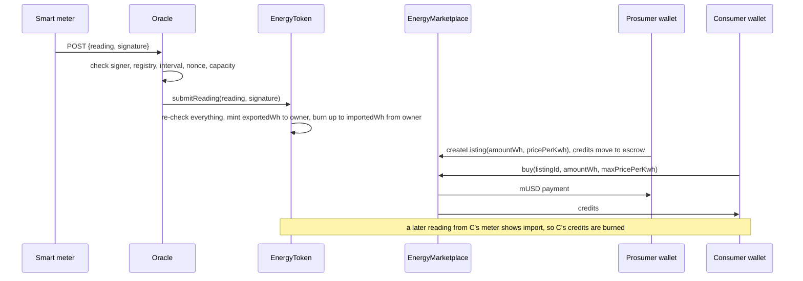

# DER energy marketplace — proof of concept

Households with rooftop solar and batteries ("prosumers") earn a token for every kWh they export to the grid. Their neighbours ("consumers") buy those tokens peer-to-peer with a stablecoin, and the tokens are burned when the buyer's meter shows the energy was consumed.

Everything runs locally: a Hardhat chain, three Solidity contracts, a meter simulator, an oracle service, a trading bot for each household, a settlement report and a live dashboard.

```bash
npm install && npm run demo      # then open http://localhost:3000
```

---

## Assumptions

These choices shape the whole PoC. Anything not listed here is covered under [Known limitations](#known-limitations).

1. **Local chain only.** Contracts run on an in-process Hardhat node (chain id 31337) with Hardhat's public test mnemonic. No testnet, nothing of value.
2. **1 token = 1 kWh of verified *exported* energy.** The token (`EKWH`) has 3 decimals, so one base unit is exactly 1 Wh and meters report whole Wh. Solar consumed behind the meter is never tokenized; only energy the grid meter records as exported is.
3. **15-minute settlement intervals.** Each meter reports one reading per interval containing both exported and imported Wh.
4. **"Consumed" means imported through the owner's meter.** When a reading shows import, up to that many credits are burned from the meter owner's wallet. Any import not covered by credits is ordinary grid supply, billed by the utility off-chain. Credits bought *after* the consumption do not cover it retroactively.
5. **The P2P market is financial, not physical.** Electricity flows through the distribution grid as usual; the marketplace settles who pays whom. Grid constraints, network fees and locational pricing are out of scope.
6. **Where the burn lives.** The brief groups "tokens are burned when the energy is consumed" with the marketplace. In this PoC the burn is triggered by the same meter-signed reading that mints, so it is implemented next to minting in `EnergyToken` (`CreditsBurned` event). `EnergyMarketplace` emits the listing, re-price, cancel and trade events. Together they emit an event for every listing, trade and burn.
7. **One oracle and one admin.** A single oracle key holds `ORACLE_ROLE`. The deployer holds admin, registrar (meter onboarding) and pauser roles. The contract re-checks every reading, so the oracle is trusted for liveness, not correctness.
8. **Meter keys are software keys** derived deterministically from the participant id (`meterKey()` in `src/shared/participants.ts`) so every run uses the same meter identities. Real meters would generate keys in a secure element.
9. **Simulated day.** 2026-06-21 (summer solstice) by default, clock in UTC, treated as local solar time for a site at 37.4° N. Weather and noise use a fixed seed, so every run produces the same day. Physics models are illustrative, not engineering grade.
10. **Money.** Payments use `MockStablecoin` (mUSD, 6 decimals). Each consumer starts with $25; prosumers start with nothing. For comparison only, grid retail is taken as $0.30/kWh and the utility feed-in rate as $0.05/kWh.
11. **Households are bots.** Simple rule-based agents act on behalf of each household's wallet (see [The simulated day](#the-simulated-day)).

---

## Quick start

**Requirements:** Node.js 18.18 or newer (developed and tested with Node 22) and npm. The first compile downloads the Solidity 0.8.28 compiler, so it needs internet access once.

```bash
npm install
npm run demo
```

`npm run demo` compiles the contracts, starts the chain, deploys, and simulates 24 hours in about 1.5 minutes (paced so you can watch it). Open **http://localhost:3000** while it runs. When the day ends it prints and saves the settlement report and keeps the chain and dashboard running until you press Ctrl+C.

| Command | What it does |
|---|---|
| `npm run demo` | Full paced demo; keeps running at the end so you can explore the dashboard |
| `npm run demo:fast` | Same simulation with no pacing (about 45 s); exits with code 0 only if every integrity check and security scenario passed |
| `npm test` | Unit tests for both contracts and the oracle (68 tests) |
| `npm run report` | Rebuild the settlement report from the running chain (run in a second terminal while the demo is up) |
| `npm run typecheck` | TypeScript type check of everything |
| `npm run compile` | Compile contracts and generate TypeChain types |

**Configuration (environment variables):** `SIM_DATE` (default `2026-06-21`), `DEMO_INTERVAL_MS` (pause per 15-minute interval, default `350`), `RPC_PORT` (`8545`), `ORACLE_PORT` (`8600`), `DASHBOARD_PORT` (`3000`). For example `SIM_DATE=2026-12-21 npm run demo` simulates a winter day.

**Outputs:** `deployments/localhost.json` (contract addresses, participants), `reports/settlement-<date>.md` and `.json`, and `reports/telemetry-<date>.json` (simulated behind-the-meter PV and load).

---

## Architecture



One 15-minute interval, end to end:



### Components

| Component | Where | What it does |
|---|---|---|
| **EnergyToken** | `contracts/EnergyToken.sol` | ERC-20 + `AccessControl` + `Pausable` + EIP-712. Meter registry (owner, rated export, service limit). `submitReading` is the only way to mint: it verifies the meter's signature and replay/capacity rules on-chain, mints `exportedWh` to the owner, then burns up to `importedWh`. |
| **EnergyMarketplace** | `contracts/EnergyMarketplace.sol` | Order book: `createListing` (escrows credits), `updatePrice`, `cancelListing` (always allowed, even when paused), `buy` with partial fills and a `maxPricePerKwh` guard. Payment goes straight to the seller. `ReentrancyGuard`, `SafeERC20`, pausable, no loops. |
| **MockStablecoin** | `contracts/MockStablecoin.sol` | 6-decimal test dollar; owner-only mint. |
| **Meter simulator** | `src/meter-simulator/` | Solar geometry plus a neighbourhood-wide cloud model, household load curves with noise, batteries (self-consumption, 90% round trip), an EV charger. Each `SmartMeter` holds its own key and a monotonic nonce and signs every reading. |
| **Oracle service** | `src/oracle/` | HTTP API (`POST /readings`, `GET /status`). Pure validation rules in `validation.ts`; `oracle.ts` relays accepted readings in order and keeps them queued while the token is paused. |
| **Trading agents** | `src/market/agents.ts` | Prosumers list new credits, discount unsold listings and withdraw them at a price floor. Consumers keep about four hours of expected consumption covered, buying the cheapest listings under their price limit. |
| **Security scenarios** | `src/scenarios/security.ts` | Attacks and failures injected during the day, run for real against the oracle and contracts. |
| **Settlement report** | `src/settlement/report.ts`, `scripts/report.ts` | Rebuilds each participant's production, sales, purchases, earnings and savings from chain events, plus six integrity checks. |
| **Dashboard** | `src/dashboard/` | Plain HTML/JS with ethers.js. Reads balances, listings, trades and readings straight from the chain, plus oracle decisions and simulator telemetry. |
| **Demo orchestrator** | `scripts/demo.ts` | Starts everything and drives the 96 intervals. |

### Folder structure

```
contracts/            EnergyToken, EnergyMarketplace, MockStablecoin
test/                 Unit tests: token, marketplace, oracle (validation + service)
scripts/
  demo.ts             End-to-end 24-hour demo
  report.ts           Settlement report from the running chain
src/
  shared/             EIP-712 reading types, participants, deploy, chain helpers, units
  meter-simulator/    Physics models, seeded RNG, signing smart meter, neighbourhood simulator
  oracle/             Validation rules, oracle service, HTTP server
  market/             Order book view and trading agents
  scenarios/          Injected security scenarios
  settlement/         Report builder and renderer
  dashboard/          HTTP server and static front end (public/)
docs/THREAT_MODEL.md  Threats, mitigations, residual risk
```

---

## How minting, trading and burning work

### Meter readings

```solidity
struct MeterReading {
    address meter;         // the meter's signing address, also its id
    uint64  intervalStart; // unix seconds, multiple of 900
    uint32  exportedWh;
    uint32  importedWh;
    uint64  nonce;         // strictly increasing per meter
}
```

The meter signs this struct with EIP-712 under the domain `{name: "EnergyToken", version: "1", chainId, verifyingContract}`, so a signature is only valid for this contract on this chain.

### Checks on every reading

| Check | Oracle (off-chain) | EnergyToken (on-chain) |
|---|---|---|
| Well-formed body, integer ranges | `MALFORMED` | enforced by ABI types |
| Signed by the claimed meter | `BAD_SIGNATURE` | `InvalidMeterSignature` |
| Meter registered and active | `UNKNOWN_METER`, `METER_INACTIVE` | `UnknownMeter`, `MeterNotActive` |
| Interval on a 15-minute boundary | `MISALIGNED_INTERVAL` | `IntervalNotAligned` |
| Interval already finished | `FUTURE_INTERVAL` | `IntervalNotFinished` |
| Not older than 6 hours | `STALE_READING` | — |
| Exact replay | `DUPLICATE` | covered by the next two rows |
| Interval newer than the last settled one (no double counting) | `INTERVAL_ALREADY_SETTLED` | `IntervalAlreadySettled` |
| Nonce newer than the last one | `REPLAYED_NONCE` | `StaleNonce` |
| Export ≤ rated PV capacity for 15 min | `EXPORT_ABOVE_CAPACITY` | `ExportAboveCapacity` |
| Import ≤ service connection for 15 min | `IMPORT_ABOVE_CAPACITY` | `ImportAboveCapacity` |
| Caller holds `ORACLE_ROLE` | — | `AccessControlUnauthorizedAccount` |

### Roles

| Role | Contract | Holder in the demo | Can |
|---|---|---|---|
| `DEFAULT_ADMIN_ROLE` | both | deployer | grant and revoke roles |
| `REGISTRAR_ROLE` | EnergyToken | deployer (the "utility") | register, suspend and reinstate meters |
| `ORACLE_ROLE` | EnergyToken | oracle service key | submit readings (the only way to mint) |
| `PAUSER_ROLE` | both | deployer | pause and unpause |

### Events

| Contract | Events |
|---|---|
| EnergyToken | `MeterRegistered`, `MeterStatusChanged`, `ReadingSettled`, `CreditsMinted`, `CreditsBurned` (plus ERC-20 `Transfer`, `Paused`, role events) |
| EnergyMarketplace | `ListingCreated`, `ListingPriceUpdated`, `ListingCancelled`, `Trade` |

Cost of a purchase is `amountWh × pricePerKwh / 1000`, rounded up to the smallest stablecoin unit.

---

## The simulated day

| Id | Household | PV | Battery | Pricing |
|---|---|---|---|---|
| P1 | prosumer | 6 kW | 10 kWh | asks $0.14/kWh |
| P2 | prosumer | 4.5 kW | — | asks $0.12/kWh |
| P3 | prosumer | 8 kW | 13.5 kWh | asks $0.16/kWh |
| P4 | prosumer | 5 kW | — | asks $0.13/kWh |
| P5 | prosumer | 7 kW | 10 kWh | asks $0.15/kWh |
| C1 | family home | — | — | pays up to $0.22/kWh |
| C2 | apartment | — | — | pays up to $0.20/kWh |
| C3 | home with EV charging 18:30–21:00 | — | — | pays up to $0.24/kWh |
| C4 | home office | — | — | pays up to $0.18/kWh |
| C5 | small café | — | — | pays up to $0.15/kWh |

Agent rules:

- **Prosumers** list each new kWh of credits at their ask price. A listing that hasn't sold for two hours is discounted 10%; one that would fall below $0.08/kWh is withdrawn and the credits are kept to cover the household's own evening import.
- **Consumers** keep enough credits for their expected consumption over the next four hours, buying cheapest listings first, up to their price limit, and always passing the price they saw as `maxPricePerKwh`.

Security scenarios injected into the day (each one is a real attempt against the running system):

| Time | Scenario | Expected outcome |
|---|---|---|
| 09:00 | Spoofed meter: a reading claiming P1's meter signed by another key, and a reading from an unregistered meter | Oracle rejects: `BAD_SIGNATURE`, `UNKNOWN_METER` |
| 09:30 | Replay and double counting: re-send P2's settled reading; P2's meter re-signs the same interval with a new nonce | Oracle rejects: `DUPLICATE`, `INTERVAL_ALREADY_SETTLED` |
| 10:00 | Implausible production: P4's meter signs 3× its rated export | Oracle rejects: `EXPORT_ABOVE_CAPACITY` |
| 11:00 | Compromised oracle: the oracle key calls the contract directly with a forged reading, a replayed reading, and a meter registration; an outsider submits a reading | Contract reverts: `InvalidMeterSignature`, `IntervalAlreadySettled`, `AccessControlUnauthorizedAccount` (×2) |
| 12:00 | Front-running: with auto-mining off, a seller re-prices a listing with a higher tip than a pending buy | Both land in one block, re-price first; the buy reverts with `PriceAboveLimit` and the buyer pays nothing |
| 13:00–13:15 | Emergency pause of EnergyToken | 10 readings queue at the oracle, trading halts; after unpause all 10 settle in order |

---

## Settlement report

Produced at the end of every demo run (and by `npm run report`). Excerpt from the default run:

**Prosumers** (kWh unless noted)

| Prosumer | PV generated | Exported (minted) | Sold P2P | Earnings | Avg price | vs feed-in | Self-used credits |
|---|---:|---:|---:|---:|---:|---:|---:|
| P1 · 6 kW PV + 10 kWh battery | 37.17 | 17.07 | 16.73 | $2.34 | $0.140 | +$1.51 | 0.00 |
| P2 · 4.5 kW PV | 27.73 | 19.89 | 18.52 | $2.22 | $0.120 | +$1.30 | 1.37 |
| P3 · 8 kW PV + 13.5 kWh battery | 49.20 | 22.57 | 21.72 | $3.25 | $0.150 | +$2.16 | 0.00 |
| P4 · 5 kW PV | 30.56 | 19.84 | 18.82 | $2.45 | $0.130 | +$1.51 | 1.02 |
| P5 · 7 kW PV + 10 kWh battery | 43.36 | 23.18 | 23.00 | $3.22 | $0.140 | +$2.07 | 0.00 |

**Consumers**

| Consumer | Load | Bought P2P | Spent | Avg price | Consumed from credits | Grid-supplied | Saved vs grid |
|---|---:|---:|---:|---:|---:|---:|---:|
| C1 · family home | 26.97 | 19.57 | $2.69 | $0.138 | 18.62 | 8.35 | +$3.18 |
| C2 · apartment | 11.55 | 8.21 | $1.10 | $0.134 | 8.21 | 3.33 | +$1.37 |
| C3 · home + EV charging | 38.79 | 33.14 | $4.57 | $0.138 | 32.03 | 6.75 | +$5.37 |
| C4 · home office | 23.91 | 16.98 | $2.32 | $0.137 | 16.98 | 6.93 | +$2.77 |
| C5 · small café | 34.19 | 20.89 | $2.79 | $0.134 | 20.89 | 13.30 | +$3.47 |

Totals: 102.55 kWh minted, 98.80 kWh traded for $13.48 (average $0.136/kWh), 99.13 kWh burned on consumption, 3.42 kWh of credits outstanding.

Integrity checks (all pass): every credit traces to a signed reading · no interval credited twice · supply = minted − burned · supply = wallets + escrow · escrow = open listings · stablecoin conserved.

"PV generated" and "Load" come from simulator telemetry because they happen behind the meter; every other figure is read from chain events.

---

## Dashboard

`http://localhost:3000` refreshes every 1.5 seconds and shows:

- simulated clock, day progress, token status (active or paused)
- headline figures: credits minted, traded peer-to-peer, credits burned, average P2P price, oracle decisions
- neighbourhood export and import per 15-minute interval (hover for values)
- income per prosumer
- meter readings: latest settled interval per meter, with PV, load and battery state
- balances: credits in wallet and in escrow, stablecoin, sold or bought kWh, earned or spent
- open listings and trade history
- security scenario outcomes and the oracle feed, with every rejected reading pinned

The browser talks to the chain through a proxy that only forwards read-only JSON-RPC methods.

---

## Tests

```bash
npm test
```

68 tests in three files:

- `test/EnergyToken.test.ts`: metadata; role setup; meter registry (registrar-only, no re-registration, suspend and reinstate); minting (oracle-only, no other mint path, revoked oracle, capacity limits); signatures (wrong key, tampered fields, cross-contract replay, malformed, unregistered meter, digest parity with off-chain code); replay and double counting (exact replay, same interval with a new nonce, older interval, stale nonce, nonce gaps, unfinished and misaligned intervals); consumption burn (partial, capped at balance, none, netting); pause; role administration.
- `test/EnergyMarketplace.test.ts`: escrow on listing; zero checks; no double selling; approvals; full and partial fills; rounding; over-buying; self-trade; unknown listing; unpayable buys; front-running protection; re-pricing permissions; cancellation; burn of purchased credits; escrow not burnable; pause (with cancel always allowed); token pause halting trades; access control.
- `test/Oracle.test.ts`: every validation rule on its own, plus the service against a local chain (settle, reject replay, queue while paused and drain in order).

---

## Security and threat model

The full analysis, with code pointers and residual risks, is in **[docs/THREAT_MODEL.md](docs/THREAT_MODEL.md)**. In short:

| Threat | What the PoC does | Deferred |
|---|---|---|
| **Spoofed meters** | Every reading carries an EIP-712 signature from the meter's own key, checked by the oracle and again by the contract. Only the registrar can onboard meters. | Keys in secure elements, device attestation, revocation |
| **Compromised oracle** | The contract re-verifies signature, registration, replay and capacity, so a stolen oracle key cannot mint unsigned energy, replay readings or register meters. The role is revocable and the token pausable. | The oracle can still censor or delay: needs k-of-n oracles, a direct meter fallback and monitoring |
| **Front-running** | `buy` takes `maxPricePerKwh`, so a re-price can make a buy fail but never overcharge it. Listings are escrowed. | Racing for cheap listings remains: batch auctions, commit–reveal or fair sequencing |
| **Double counting** | Strict per-meter ordering of intervals and nonces on-chain (each interval credited once), one-time meter registration, oracle de-duplication, report-level checks | Double claims across systems (net metering, certificates) need registry integration |
| **Replay** | Nonces and intervals as above; the EIP-712 domain blocks cross-chain and cross-contract replay | — |
| **Unbounded loops** | None in any contract; open listings are enumerated off-chain from events | — |

---

## Known limitations

- **Single oracle.** It cannot mint on its own, but it can withhold or delay readings. The retry queue is in memory and is lost if the process dies.
- **Meter trust.** A meter whose key is extracted can report any value up to its rated capacity; the only plausibility check is that cap (no irradiance model, no comparison with neighbours).
- **Privacy.** Every 15-minute reading is public on-chain, which reveals household routines.
- **Market design.** A first-come order book with no time matching (noon solar can cover evening use), no grid constraints and no network fees. Credits never expire. Dust listings can linger until withdrawn.
- **Admin key.** A single externally owned account holds admin, registrar and pauser roles. No multisig, timelock or upgrade path.
- **Throughput.** One transaction per reading per meter is fine locally but would be far too expensive on Ethereum mainnet.
- **Simulation.** The physics and trading behaviour are simple and deterministic. The listing-cancellation path is covered by unit tests but rarely triggers in the default day, because demand exceeds supply.
- **Tooling.** Hardhat 2 with ethers v6. `npm audit` reports advisories in Hardhat's transitive development dependencies; they affect local tooling only.

---

## What a production version would need

**Real meter integration**
- Revenue-grade smart meters (AMI) that sign readings in a secure element or TPM, with the utility provisioning the keys and able to rotate and revoke them. Alternatively, source readings from the utility's meter data management system over standard interfaces (DLMS/COSEM / IEC 62056, ANSI C12, IEEE 2030.5, Green Button).
- Trusted time, handling of gaps and outages, and the utility's validation, estimation and editing (VEE) process for meter data.
- Plausibility checks against irradiance data, neighbouring systems and inverter telemetry.

**Regulatory and utility interconnection**
- Interconnection approval for every DER (e.g. IEEE 1547 / UL 1741 in the US) and the utility or DSO acting as meter registrar.
- A legal basis for peer-to-peer sales: retail supply licensing, net metering and tariff rules, distribution and network charges, and settlement with the utility's billing and the market or balancing operator.
- Integration with renewable certificate registries (I-REC, GO, M-RETS and similar) so each kWh is claimed exactly once.
- Consumer protection, KYC/AML for payments, tax treatment, and a legal classification of the token.

**Privacy**
- Keep raw interval data off-chain (held by the utility) and put only commitments (hashes or Merkle roots) on-chain, or publish aggregates.
- Zero-knowledge proofs such as "this meter exported X kWh in this period" without revealing the load profile.
- Pseudonymous, rotating identifiers; data protection compliance (GDPR / CCPA); restricted visibility on a permissioned network.

**Scaling and infrastructure**
- An L2 rollup for public settlement, or a permissioned chain (e.g. Hyperledger Besu with QBFT) run by utilities and aggregators.
- Batch readings per interval (one Merkle root per oracle round instead of one transaction per meter) and match orders off-chain with on-chain settlement or periodic netting.
- A regulated stablecoin or e-money token, or settlement through utility bills, instead of the mock stablecoin.
- An indexer (e.g. a subgraph) instead of scanning logs, and a durable, highly available oracle queue.

**Security and operations**
- Several independent oracle operators with k-of-n threshold signatures, a direct submission path for meters, and dispute windows.
- Multisig admin behind a timelock (e.g. `AccessControlDefaultAdminRules`) and a documented upgrade strategy.
- Audits, fuzzing and invariant testing, monitoring and alerting on role and registry changes, and incident runbooks.

**Market design**
- Per-interval double auctions or batch clearing, hourly time matching, locational constraints from the DSO, and rules for unsold credits (expiry or buy-back at feed-in).

---

## License

MIT — see [LICENSE](LICENSE).
